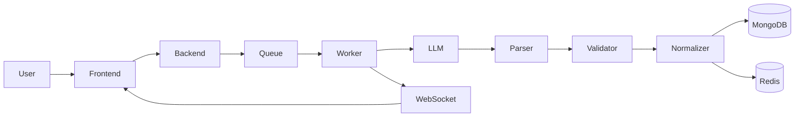

# 🧠 Assignly

  <strong>AI-powered Assessment Creator with Structured Generation, Validation & Real-Time Processing</strong>

  Generate exam-ready question papers using AI — backed by validation pipelines, async processing, and real-time updates.

  

  <a href="https://youtu.be/Rtrf6n0DlC8">
    <b>▶ Watch Full Video Demo</b>
  </a>

---

## 🚀 Overview

Assignly is a **production-grade AI system** designed to generate structured, validated, and reliable question papers.

Unlike typical AI tools, Assignly does **not trust raw AI output**.
Instead, it enforces a strict processing pipeline to ensure:

* Structured output
* Validation of content
* Consistent formatting
* Reliable delivery

---

## 🎥 Demo

👉 Full working demo: https://youtu.be/Rtrf6n0DlC8

---

## 🧠 Core Pipeline

Parse → Validate → Normalize → Store → Deliver

---

## ⚙️ How the System Behaves

Assignly follows a **controlled AI execution model**, not a direct generation approach.

### 🔹 Controlled Execution Flow

* User input is first structured (not directly sent to AI)
* AI output is treated as **untrusted data**
* Multiple validation layers ensure correctness before storing

### 🔹 Async & Scalable Design

* Requests are queued instead of blocking APIs
* Workers process jobs independently
* Designed to handle high concurrency

### 🔹 Fault-Tolerant Processing

* Retry mechanism for failed AI responses
* Invalid outputs are rejected immediately
* Fallback regeneration ensures reliability

### 🔹 Real-Time Feedback Loop

* WebSockets push instant updates
* No polling required
* Improves user experience with live progress

---

## 🛠️ Tech Stack

| Layer       | Technologies                      |
| ----------- | --------------------------------- |
| Frontend    | Next.js, TypeScript, Tailwind CSS |
| Backend     | Node.js, Express, TypeScript      |
| Database    | MongoDB Atlas                     |
| Queue/Cache | Redis + BullMQ                    |
| Real-Time   | WebSockets                        |
| AI          | Gemini / LLM APIs                 |
| Deployment  | Vercel, Render, Upstash           |

---

## ✨ Features

* AI-based question paper generation
* Difficulty-controlled structured input
* Validation pipeline for output quality
* Background job processing using BullMQ
* Real-time updates via WebSockets
* Credit-based usage system

---

## 🏗️ Architecture

---

## 🔄 System Flow

1. User submits assignment request
2. API pushes job to queue
3. Worker processes request:

   * AI Generation
   * Parsing
   * Validation
   * Normalization
4. Data stored in DB & cache
5. Real-time updates sent via WebSocket
6. Frontend fetches final result

---

## 🧠 AI Processing Pipeline

* Prompt Builder → structured input
* AI Generation → question paper
* Parser → extracts JSON
* Validator → removes invalid data
* Normalizer → fixes format & duplicates

⚠️ Raw AI output is never exposed directly.

---

## 📊 Marks Engine

* Difficulty-based distribution
* Weighted marks allocation
* Ensures total marks consistency

---

## 🛟 Reliability

* 🔁 Retry mechanism (up to 3 attempts)
* ❌ Invalid output rejection
* 🛡️ Fallback generation strategy
* 🔍 Duplicate removal

---

## ⚡ Performance

* ⚡ Redis caching
* 🔄 Asynchronous processing
* 🚀 Cache-first data fetching

---

## 🚀 Deployment

| Service  | Platform      |
| -------- | ------------- |
| Frontend | Vercel        |
| Backend  | Render        |
| Redis    | Upstash       |
| Database | MongoDB Atlas |

---

## 🔮 Future Improvements

* ⚡ Improved AI accuracy with self-validation
* 📄 Multi-format export (PDF, DOCX, JSON)
* 🎓 Advanced difficulty & marking system
* 🧠 Answer key validation via file upload

---

## 🤝 Contributing

1. Fork the repository
2. Create your feature branch
3. Commit your changes
4. Open a Pull Request

---

## 📄 License

MIT License

---

  Made with ❤️ by <strong>Nikhil Gupta</strong>  
  ⚡ Passionate about AI, Systems Design & Scalable Applications

