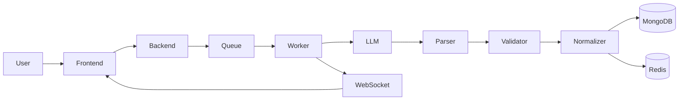

# 🧠 Assignly

  <strong>AI-powered Assessment Creator with Structured Generation, Validation & Real-Time Processing</strong>

  Generate exam-ready question papers using AI — backed by validation pipelines, async processing, and real-time updates.

---

## 🚀 Overview

Assignly is a production-grade AI system that ensures generated content is:

* Structured
* Validated
* Reliable

Pipeline:

**Parse → Validate → Normalize → Store → Deliver**

---

## 📄 Sample Output (PDF)

* 📄 Sample Paper 1: https://drive.google.com/file/d/1oY42GvxsnvGZAqU4zBKAk52r3ARF-kHU/view?usp=sharing
* 📄 Sample Paper 2: https://drive.google.com/file/d/10sPlg7DXI03NttIcJ0eub04n0q7KMz2O/view?usp=sharing

---

## 📸 Screenshots

  
  

  

---

## 🛠️ Tech Stack

| Layer         | Technologies                      |
| ------------- | --------------------------------- |
| Frontend      | Next.js, TypeScript, Tailwind CSS |
| Backend       | Node.js, Express, TypeScript      |
| Database      | MongoDB Atlas                     |
| Queue & Cache | Redis + BullMQ                    |
| Real-Time     | WebSocket                         |
| AI            | Gemini / LLM APIs                 |
| Deployment    | Vercel, Render, Upstash           |

---

## ✨ Features

* AI-based question paper generation
* Structured input with difficulty control
* Validation pipeline for quality assurance
* Background job processing (BullMQ)
* Real-time updates via WebSockets
* Credit-based usage system

---

## 🏗️ Architecture

---

## 🔄 Flow

1. User submits assignment
2. API queues job
3. Worker processes (AI → validate → normalize)
4. Data stored + cached
5. Real-time updates sent
6. Frontend fetches result

---

## 🧠 AI Pipeline

* Prompt Builder → structured input
* AI Generation → question paper
* Parser → JSON extraction
* Validator → removes invalid data
* Normalizer → fixes format & duplicates

> Raw AI output is never shown directly.

---

## 📊 Marks Engine

* Difficulty-based distribution
* Weighted marks allocation
* Ensures total consistency

---

## 🛟 Reliability

* Retry mechanism (3 attempts)
* Invalid output rejection
* Fallback generation
* Duplicate removal

---

## ⚡ Performance

* Redis caching
* Async processing
* Cache-first fetching

---

## 🚀 Deployment

* Frontend: Vercel
* Backend: Render
* Redis: Upstash
* Database: MongoDB Atlas

---

## 🔮 Future Improvements

* 🧠 Improve AI accuracy with better validation & self-checking
* 🧩 Advanced MCQs with explanations and difficulty control
* 📄 PDF export with clean, exam-ready formatting

---

## 🤝 Contributing

1. Fork repo
2. Create branch
3. Open PR

---

## 📄 License

MIT

---

  Made by <strong>Nikhil Gupta</strong>

